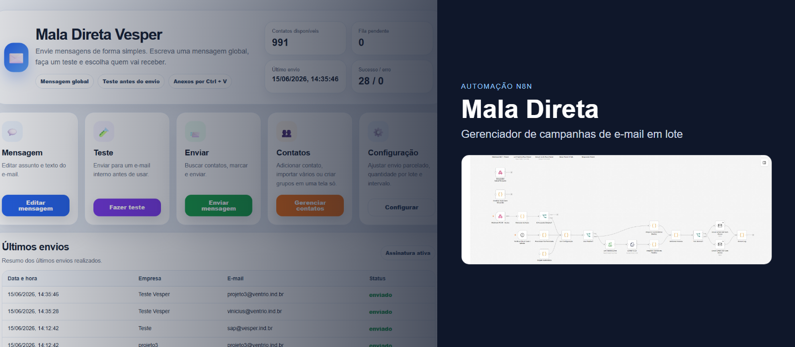

  

<h1 align="center">Mala Direta</h1>

  <strong>Bulk email campaign automation with n8n, web panel, persistent queues, and deduplication.</strong>

  <a href="README.md">🇧🇷 Versão em Português</a>

---

## What is this project?

**Mala Direta** is a bulk email campaign manager built on n8n. It replaces a manual process with an intuitive web panel accessible to any employee.

See the [Portuguese README](README.md) for full documentation, screenshots, and setup instructions.

---

  Developed by <a href="https://github.com/Mayconxzdev">Mayconxzdev</a>

