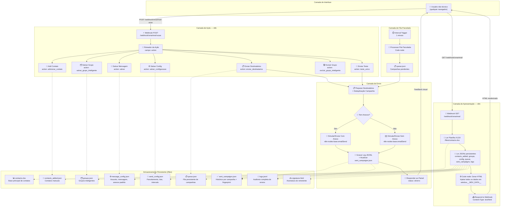
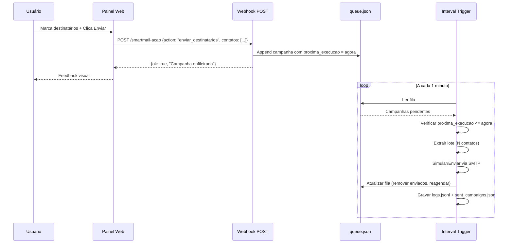

# Arquitetura — SmartMail Automation

Este documento descreve a arquitetura técnica completa do SmartMail Automation, explicando como todos os componentes se integram.

---

## Visão Geral

O sistema é construído sobre o **n8n** como plataforma de automação central. Ele expõe dois webhooks principais:

1. **GET `/webhook/smartmail`** — Carrega e renderiza o painel web completo
2. **POST `/webhook/smartmail-acao`** — Recebe todas as ações do usuário (salvar mensagem, enviar, gerenciar contatos, etc.)

Um **Interval Trigger** adicional processa a fila parcelada a cada minuto em background.

---

## Fluxo Completo de Dados

---

## Componentes Principais

### 1. Painel Web (HTML/CSS/JS)

O painel é gerado inteiramente no servidor (n8n Code node) a cada requisição GET. Todos os dados são serializados em JSON e injetados na variável global `window.__MDV_DATA__`. O JavaScript do frontend acessa esses dados sincronamente na carga da página — sem requisições adicionais de API para renderização inicial.

**Modais disponíveis:**
- `#modal_mensagem` — Editor de mensagem com prévia em tempo real
- `#modal_teste` — Envio de teste para validação
- `#modal_enviar` — Seleção de destinatários com filtro de grupo
- `#modal_contatos` — Menu de gerenciamento de contatos
- `#modal_add` — Formulário de adição individual
- `#modal_importar` — Importação em massa (texto, CSV, TXT, VCF)
- `#modal_grupo` — Gerenciamento de grupos inteligentes
- `#modal_config` — Configuração de parcelamento

### 2. Webhook POST e Roteamento

Todas as ações do painel enviam um POST para `/webhook/smartmail-acao` com payload JSON contendo o campo `action`. O n8n roteia a execução com base neste campo. A resposta é sempre um objeto `{ok: true, message: '...'}` ou `{ok: false, error: '...'}`, processado pelo JavaScript do painel para exibir feedback ao usuário.

### 3. Fila Parcelada

A fila é um array de objetos em `queue.json`. Cada objeto representa uma campanha em andamento com:
- `campanha_id`: Fingerprint da campanha (hash FNV-1a sobre assunto+mensagem)
- `contatos`: Array de destinatários restantes
- `lote_quantidade`: Tamanho do lote atual
- `intervalo_valor` + `intervalo_unidade`: Intervalo entre lotes
- `proxima_execucao`: ISO timestamp da próxima execução
- `anexos_base64`: Anexos convertidos em Base64

O Interval Trigger lê a fila a cada minuto. Se `proxima_execucao <= agora` e há contatos pendentes, extrai o lote, processa o envio, atualiza `proxima_execucao` e salva o estado.

### 4. Deduplicação

**Nível 1 — Intra-campanha:** Durante a seleção de destinatários, e-mails duplicados na seleção são removidos antes de qualquer envio. O array de contatos da fila também filtra duplicatas antes de processar.

**Nível 2 — Global por campanha:** O `campanha_id` é gerado com hash FNV-1a sobre `assunto + mensagem`. Antes de cada envio, o sistema verifica em `sent_campaigns.json` se aquele e-mail já recebeu a campanha com aquele `campanha_id`. Se sim, o contato é ignorado. O reenvio pode ser liberado manualmente desmarcando a proteção no painel.

### 5. Persistência de Dados

Todos os dados ficam em `/files` — uma pasta montada como volume Docker externo ao container. Isso garante:
- Persistência após reinicializações do container
- Backup simples via cópia da pasta do host
- Portabilidade para outros hosts

---

## Diagrama de Sequência — Envio Parcelado

---

## Arquivos de Configuração

| Arquivo | Formato | Conteúdo |
|---|---|---|
| `contacts.xlsx` | Excel | Base principal de contatos (Empresa, E-mail) |
| `contacts_added.json` | JSON Array | Contatos adicionados manualmente via painel |
| `groups.json` | JSON Object | Mapeamento grupo → lista de e-mails |
| `message_config.json` | JSON Object | Assunto, mensagem texto, anexos padrão (Base64) |
| `send_config.json` | JSON Object | parcelado_ativo, lote_quantidade, intervalo_valor, intervalo_unidade |
| `queue.json` | JSON Array | Campanhas em andamento com fila de contatos |
| `sent_campaigns.json` | JSON Object | Histórico por campanha_id de e-mails já enviados |
| `logs.jsonl` | JSONL | Uma linha JSON por envio com data, empresa, e-mail, status, erro |
| `signature.html` | HTML | Assinatura do remetente inserida automaticamente |
